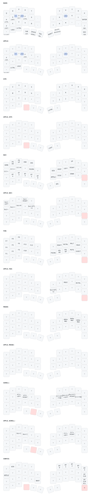

# zmk-config-roBa

ZMK configuration for roBa. It provides switchable Windows/Linux and Apple layouts for iPhone and Mac hosts.

## Switching the layout

The Apple/Windows choice is stored independently for each Bluetooth profile. The setting applies to the currently selected profile and is restored automatically when that profile is selected again.

Hold the left thumb **Esc (NAV)**, then tap one of these keys:

| NAV key | Action |
| --- | --- |
| `;` | Save Windows/Linux for the current profile |
| `=` | Save Apple for the current profile |

All profiles default to Windows/Linux. The setting is stored in the controller's persistent settings and survives power cycles and regular firmware updates.

In Apple mode, leave the host's modifier-key mapping at its standard setting. If Control and Command were swapped in the host settings, restore the default mapping.

## Apple layout changes

| Location or action | Windows/Linux | Apple |
| --- | --- | --- |
| Hold A/F, or bottom-row Ctrl | Control | Command |
| Bottom-row LGUI | Windows/Super | Control |
| Hold the bottom-row quote key | Control+Shift | Command+Shift |
| Right thumb Ctrl on SYM | Control | Command |
| J/L on FUN | Right Control/Right GUI | Right Command/Right Control |
| D/F on SCROLL (back/forward) | Alt+Left/Right | Command+[/] |
| H/L on SCROLL (previous/next tab) | Control+Shift+Tab/Control+Tab | Same |
| J/K on SCROLL (switch desktop) | GUI+Control+Left/Right | Control+Left/Right on Mac |
| Home/End on NAV | Home/End | Command+Left/Right (line start/end) |
| Zoom out/in/reset on NAV | Control+Minus/Equal/0 | Command+Minus/Equal/0 |
| Screenshot on NAV/FUN | Print Screen | Command+Shift+3 on Mac |

For example, hold **F**, then press **C**, **V**, or **A** for copy, paste, or select all. A/F still produce their normal letters when tapped.

The rotary encoder also follows the Apple layout. On NAV it switches tabs with Control+Tab and Control+Shift+Tab; on FUN it goes forward/back with Command+] and Command+[; and on MOUSE it zooms with Command+Equal and Command+Minus. Vertical movement in the base layer, volume control on SYM, and horizontal scrolling on SCROLL are shared by both modes.

Symbols, numbers, mouse buttons, and the Esc/Japanese-input/English-input combos are shared by both modes. Layers whose names start with APPLE show only their overrides; `▽` means that the binding falls through to a lower layer.

Shortcut behavior depends on the operating system and application. Mac desktop switching and screenshots are not applicable to iPhone. Tab switching and back/forward follow the standard Mac Safari shortcuts described by [Apple](https://support.apple.com/guide/safari/cpsh003/mac).

## Bluetooth profile switching and connection policy

The existing BT profile positions remain available:

- NAV (left-thumb Esc, or holding `/`): X → BT 4, C → BT 3, V → BT 2, B → BT 1, `-` → BT 0.
- CONFIG (hold left-thumb Tab/SYM plus right-thumb Esc/FUN): Y/U/I/O/P → BT 0/1/2/3/4.

Each BT key selects the requested profile and applies that profile's saved connection policy. The policy can be set while holding NAV:

| NAV key | Action |
| --- | --- |
| `H` | Save Maintain for the current profile |
| `N` | Save Disconnect for the current profile and disconnect inactive hosts |

Maintain leaves other host connections active. Disconnect requests a proper BLE disconnect from every inactive host, including an iPhone, while preserving pairing information. The active profile and the connection between the two roBa halves are never disconnected.

Standard ZMK Bluetooth switching allows multiple hosts to remain connected. This configuration uses the standard `BT_SEL` and `BT_DISC` behaviors together with a central-side profile settings behavior. It does not permanently disable reconnecting. See [ZMK Bluetooth Behavior](https://zmk.dev/docs/keymaps/behaviors/bluetooth).

The trade-off is that returning to a disconnected host requires a reconnect. Keystrokes sent before reconnection completes may be lost, and the wait time depends on the host and radio conditions. Keeping profiles connected is faster when moving frequently between PCs.

## Applying the firmware

Build the configuration and flash the corresponding UF2 file to each half. The build matrix is in `build.yaml`, and the GitHub Actions workflow is `.github/workflows/build.yml`. A settings reset or Bluetooth re-pairing is not required for these keymap changes.

For a reproducible local build, use the official ZMK Docker/Podman environment:

```sh
./scripts/build-local.sh
```

See [Local Docker/Podman build](docs/local-build.md) for target selection, cache locations, and the settings-reset procedure.

## Keymap


